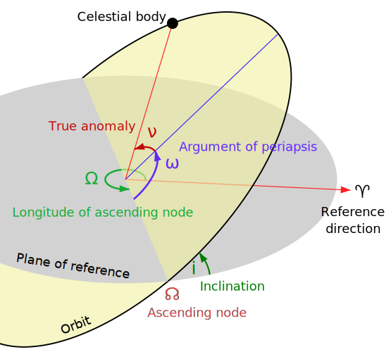
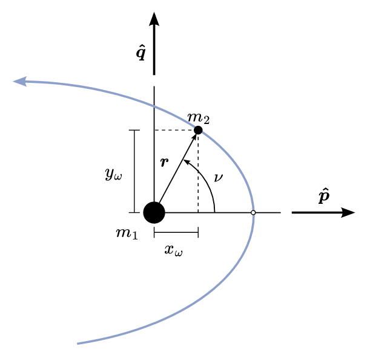
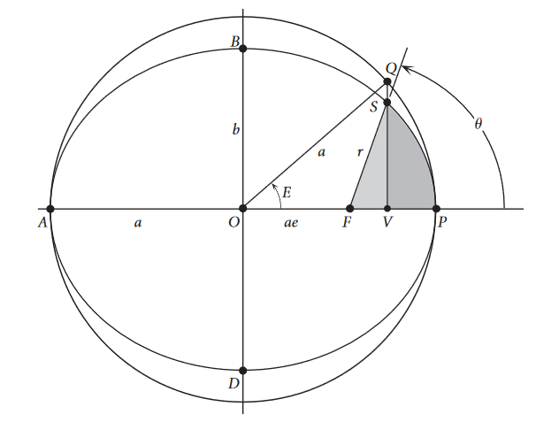
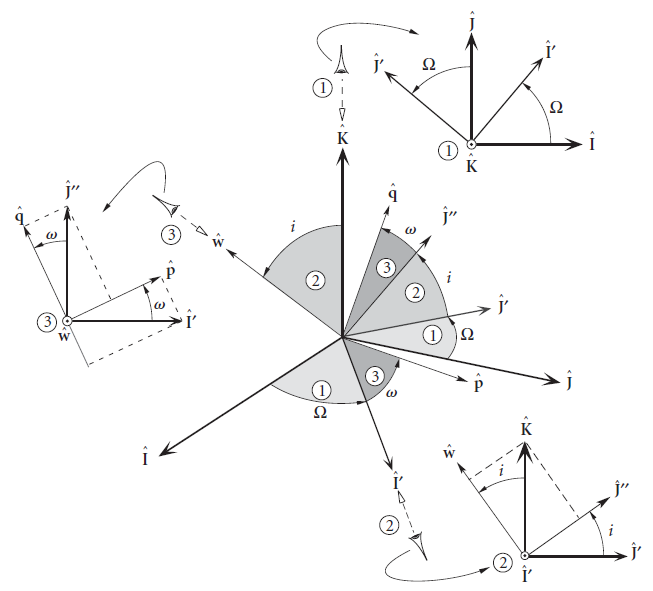
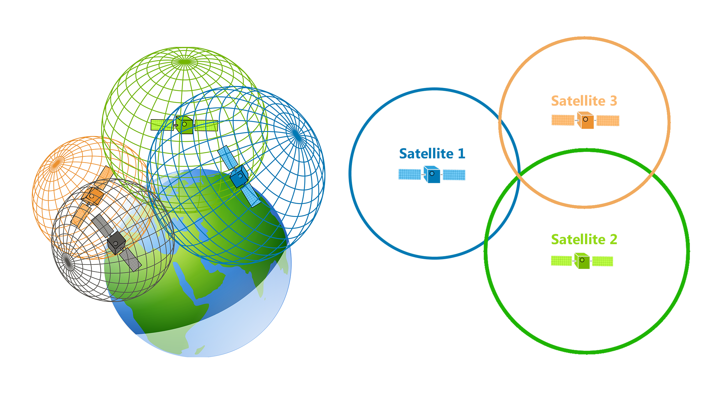

# Projeto D: GNSS e Drones

> EE400 - Métodos da Engenharia Elétrica
>
> João Felipe Contreras De Moraes - j174140@dac.unicamp.br


O **GPS** (*Global Positioning System*) é um sistema de posicionameto por rádio baseado em satélites. A sigla já faz parte do cotidiano quando deseja-se referir a um sistema de navegação por satélites capaz de determinar a posição de um receptor ou uma base de tempo, pois estão presentes nos smartphones, automóveis, na aviação e, em particular, na navegação de drones.

No entanto, o GPS é apenas uma instância de um **sistema de navegação por satélite** (GNSS) que pertence ao governo dos Estados Unidos. Atualmente existem  3 outros sistemas operacionais, além do americano: GLONASS (Rússia), BeiDou (China) e Galileo (União Europeia). Sendo que Índia também tem planos de expandir seu sistema regional (IRNSS) para escala global. O alcance global desses sistemas é obtido a partir de uma constelação com até 30 satélites em órbitas médias ($R\approx 20000\ \text{km}$) distribuídas em diferentes planos.

Os sistemas de posicionamento por rádio de forma geral são formados por um conjunto de transmissores e receptores. No caso do GNSS, o receptor pode ser visto como uma antena cuja posição desejamos determinar e os transmissores são os satélites de uma determina constelação. Os satélites transmitem sinais na banda L (frequência de 1-2 GHz), que codificam informações para determinar o tempo de envio do sinal, dados das órbitas, informações de calibração, entre outros. O receptor, com um relógio interno, é capaz de determinar o tempo de recebimento do sinal e, portanto, pode estimar o tempo entre transmissão e recepção do mesmo, denominado **TOF** (*time of flight*). A partir de um conjunto de medidas de TOF e da posição dos satélites, o receptor pode determinar sua posição resolvendo um problema geométrico chamado de **multilateração** (ou trilateração).

Dessa maneira, o presente projeto tem como objetivo explorar os conceitos usados na disciplina para a determinação da posição de um **drone** que navega no espaço, usando um receptor GNSS embarcado. Para isso, será preciso:
- Parametrizar as trajetórias dos satélites para obtenção de sua posição em cada instante de tempo,
- Resolver o problema de trilateração usando o conceito de gradiente de uma função.


Diversas aplicações se beneficiam do uso de drones e a obtenção de sua posição pode ser feita com receptores GNSS embarcados.

# Exercícios Preparatórios


## 1. (Parametrização das órbitas)

Cada constelação de satélites transmite informações distintas para descrição da órbita de seus satélites. No nosso modelo, vamos seguir as especificações do GPS e Galileo, que transmitem um conjunto de parâmetros chamados de **elementos orbitais de Kepler**, colocados na Figura  (também recebem o nome de efemérides):

- Excentricidade da órbita [$e$], que sempre vai ser um valor entre $0$ e $1$.
- Semieixo maior [$a$], metade da distância entre o apogeu e perigeu
- Argumento do perigeu [$\omega$], define a orientação da elipse no plano orbital
- Inclinação [$i$], ângulo entre o plano equatorial da terra e o plano orbital
- Longitude do nó ascendente [$\Omega$], ângulo entre uma direção de referência e o nó ascendente
- Tempo desde o perigeu [$\Delta t$], tempo decorrido desde que o satélite passou pelo perigeu.

(*apogeu*: ponto de maior distância entre satélite e terra, *perigeu*: ponto de menor distância entre satélite e terra)

(*nó ascendente*: ponto no qual a trajetória do satélite cruza o plano orbital em sentido norte)





Além desses parâmetros, usaremos o **parâmetro de gravitação padrão** da terra $\mu_\oplus = GM_\oplus$, sendo $G$ a constante da gravitação universal e $M_\oplus$ a massa da terra.

### a. (*Parametrização da forma no plano orbital*) 
    
Primeiramente, vamos começar descrevendo a elipse no sistema de coordenadas **perifocal**. Nesse sistema, a elipse está totalmente contida no plano, a origem está localizada no foco mais próximo ao perigeu, o eixo $x$ é orientado na direção do perigeu e o eixo $y$ com ângulo $\nu=90^\circ$, conforme a Figura.



Em primeiro lugar, escreva a parametrização cartesiana em termos de $r(t)$, distância entre o satélite e o centro da terra, e o ângulo $\nu(t)$, chamado de **anomalia verdadeira**.

Em seguida, use um círculo auxiliar, de forma que a elipse fique circunscrita, e defina o ângulo central $E$ (**anomalia excêntrica**) como mostra a Figura. Escreva a parametrização anterior em termos de $[E]$, $[a]$ e $[e]$.


    

### b. (*Parametrização de tempo*)

Nesse próximo passo, a dependência temporal será incluída. Para simplificar as expressões, vamos definir a **anomalia média** como $M := \frac{2\pi}{T}\Delta t$, sendo $\Delta t$ o tempo desde o perigeu e $T$ o **período orbital**. 

A dependência temporal da parametrização do item (a) é introduzida pela relação entre $E$ e $M$, dada pela **equação de Kepler**

$$E(t) - e \sin E(t) = M(t)$$

sendo $t$ o tempo atual.

Desejamos então resolver a equação de Kepler, dado um valor de $M(t)$. No entanto, ela é uma **equação transcendente**. O que isso significa e qual a implicação disso?

Abaixo segue um código de exemplo, que primeiro obtém uma solução para a equação de Kepler, em um instante $t$, e usa a solução para obter a posição no plano perifocal $(x_\omega, y_\omega)$. 

```python
# Resolver equação de Kepler para E no instante t
E = resolve_kepler(t)

# Usar parametrização, usando valor de E(t)
xw = ... # Sendo x = x(E, a, e)
yw = ... # Sendo y = y(E, a, e)
```

### c. (*Parametrização Espacial*) 

Considerando agora a disposição espacial da órbita, desejamos escrever as coordenadas do sistema perifocal em um sistema **ECI** (*Earth-Centered Inertial*). Em outras palavras, queremos descrever a órbita plana no espaço tridimensional.

Para isso, três rotações sucessivas são necessárias (Figura):

- Rotacionar em torno $z_\omega$, até que o eixo $x_\omega$ esteja alinhado com o nó ascendente,
- Rotacionar em torno do novo $x_\omega'$, até que o plano orbital e equatorial estejam alinhados,
- Rotacionar em torno de $z'$, para alinhar o nó ascendente com a direção de referência.

```python
# Obtém matriz de rotação
ângulos = ... # Os ângulos associados as rotações descritas em i, ii e iii
ordem_rotação = "ZXZ"
R = rotaciona(ordem_rotação, ângulos)

pos3d = R @ posPerifoc   # Rotaciona o vetor em coorenadas perifocais, posPerifoc = [xw, yw, 0]
# @ é o operador de multiplicação matricial
```



## 2. (Trilateração e Gradiente Descendente) 

A partir de um conjunto de medidas de distância com relação a diferentes transmissores, um receptor pode estimar sua posição resolvendo um problema geométrico de intersecção de círculos (ou esferas), como exemplifica a Figura. Para resolver esse problema, os seguintes itens são necessários:

- A posição de cada um dos satélites (não é mais um problema graças ao **Exercício 1**)
- As distância relativas para cada um dos satélites
- Equacionar cada uma das leituras
- Resolver o sistema de equações resultante




### a. (*Medidas de Distância*) 
    
A partir da leitura do **TOT** (*time of transmission*), codificado no sinal do satélite, e do relógio interno, indicando o **TOA** (*time of arrival*), o receptor é capaz de determinar o TOF (*time of flight*). Além disso, com essa última informação, ele é capaz de calcular a distância relativa para esse satélite.

Explique esse procedimento. 

### b. (*Sistema de Equações*) 
    
A partir das medidas de distância $\rho_i$ (distância entre satélite $i$ e receptor) e da posição $\mathbf{r}_i$, obtenha o sistema de equações. O que se pode afirmar sobre a linearidade desse sistema de equações?

### c. (*Encontrando Soluções*)
    
Além da natureza do sistema obtido, todas as medidas de GNSS apresentam erros e, portanto, pode ser que não exista uma solução. Dessa maneira, diversas técnicas se apoiam em **soluções iterativas** nesses cenários (como vimos no Exercício 1(b)), que buscam otimizar determinado critério.
    
Por exemplo, ao usar uma função $J(\theta)$ de critério, dependente de uma possível solução $\theta$, que assume valores maiores para soluções piores e valores menores para as melhores, o problema consiste em encontrar o valor de $\theta$ que minimiza essa função (a melhor solução possível). A notação para esse tipo de problema é:

$$\hat{\theta} = \argmin_\theta J(\theta)$$

Um critério possível no problema da localização do drone é uma função $J(\mathbf{r})$ que depende de um "chute" inicial de posição, $\mathbf{r}$, e avalia a diferença entre a medida e o valor calculado usando o chute. Uma função $J$ possível seria

$$J(\mathbf{r}) = \frac{1}{2}\sum_{i=1}^{N}\left(\|\mathbf{r}_i - \mathbf{r}\|^2 - \rho_i^2\right)^2$$

para um conjunto de $N$ medidas. 

A partir da Figura, qual o valor de $J$ quando escolhemos a posição certa do receptor (desconsiderando os erros na medida)? O que podemos dizer sobre o valor de $J$ para outros valores de $\mathbf{r}$? 

### d. (*Gradiente Descendente*)

**Problemas de otimização** são ubíquos nas diversas áreas da ciência e engenharia e, em problemas de natureza contínua, é possível usar os conceitos de análise vetorial vistos na disciplina para obter boas soluções.

(A página da Wikipedia sobre otimização merece um tour: https://en.wikipedia.org/wiki/Mathematical_optimization)

Nesse sentido, o conceito do **vetor gradiente** $\nabla f$, de uma função multivariável $f: \R^n \to \R$ em um ponto $\mathbf{x}\in \R^n$, é especialmente útil uma vez que ele indica a direção de máxima subida e máxima descida (*Problema 3 e Problema 4, Lista 3*). Portanto, o gradiente de uma função que se deseja maximizar/minimizar vai indicar o melhor caminho local.

Usando essas ideias, descreva um método iterativo de otimização que use o gradiente e demonstre como ele pode ser aplicado para o problema de **trilateração**:

$$\argmin_\mathbf{r} \frac{1}{2}\sum_{i=1}^{N}\left(\|\mathbf{r}_i - \mathbf{r}\|^2 - \rho_i^2\right)^2$$

# Projeto

O objetivo do projeto é implementar um programa que seja capaz de determinar a posição de um drone em múltiplos instantes de tempo, a partir dos dados fornecidos por um receptor GNSS embarcado.

O programa pode ser implementado em qualquer linguagem e as especificações são:

I. Deve ser capaz de resolver as posições dos satélites, considerando que as informações obtidas pelo receptor seguem as especificações do **Exercício 1**.

II. Deve ser capaz de estimar a posição do drone em um instante de tempo, com o método discutido no **Exercício 2**.

A implementação deve ser original, mas é permitido o uso de funções e módulos auxiliares para passos intermediários. Não é permitido usar bibliotecas que satisfaçam, em totalidade, as especificações I. e/ou II.

(Em caso de dúvidas sobre as restrições, entre em contato.)